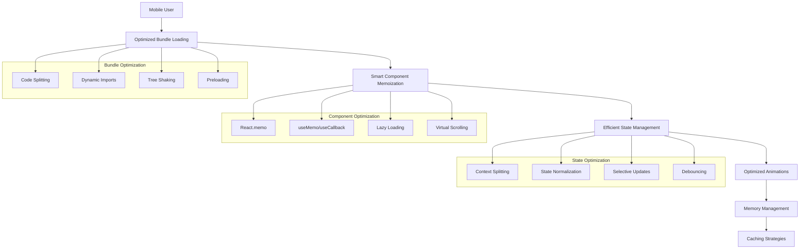

# Mobile Performance Optimization Design Document

## Overview

This design document outlines a comprehensive performance optimization strategy for a Next.js dashboard application experiencing severe mobile performance issues. The current application shows 1-second delays during tab navigation, which significantly impacts user experience on mobile devices. The optimization approach focuses on smart, calculated improvements that preserve all existing design elements, functionality, and Framer Motion animations while dramatically improving performance.

### Current Performance Analysis

Based on code analysis, several performance bottlenecks have been identified:

1. **Heavy Component Re-renders**: Components like `DashboardStats` and `TestsTable` lack proper memoization
2. **Inefficient Bundle Loading**: Large dependencies loaded synchronously without code splitting
3. **Unoptimized Animation Patterns**: Framer Motion animations triggering unnecessary re-renders
4. **Memory Leaks**: Missing cleanup in hooks and context providers
5. **Inefficient State Management**: Multiple state updates causing cascade re-renders
6. **Large Bundle Size**: Heavy libraries like Recharts, Radix UI components loaded eagerly

## Architecture

### Performance Optimization Layers



### Core Performance Strategy

1. **Bundle Size Reduction**: Implement aggressive code splitting and dynamic imports
2. **Component Memoization**: Add strategic React.memo, useMemo, and useCallback
3. **Animation Optimization**: Optimize Framer Motion for mobile performance
4. **Memory Management**: Implement proper cleanup and resource management
5. **Caching Strategy**: Add intelligent caching for data and components
6. **Mobile-First Optimizations**: Specific optimizations for mobile devices

## Components and Interfaces

### 1. Bundle Optimization Components

#### Dynamic Import Manager
```typescript
interface DynamicImportManager {
  loadComponent<T>(
    importFn: () => Promise<{ default: T }>,
    fallback?: React.ComponentType
  ): React.ComponentType<any>
  
  preloadComponent(importFn: () => Promise<any>): void
  
  getLoadingState(componentName: string): 'loading' | 'loaded' | 'error'
}
```

#### Code Splitting Strategy
- **Route-level splitting**: Each dashboard tab as separate chunk
- **Component-level splitting**: Heavy components (charts, tables) dynamically loaded
- **Library splitting**: Heavy libraries (Recharts, Framer Motion) in separate chunks

### 2. Component Memoization Layer

#### Memoized Component Wrapper
```typescript
interface MemoizedComponentProps {
  shouldUpdate?: (prevProps: any, nextProps: any) => boolean
  debugName?: string
}

interface PerformanceMonitor {
  trackRender(componentName: string, renderTime: number): void
  getComponentStats(componentName: string): ComponentStats
}
```

#### Smart Memoization Strategy
- **Shallow comparison**: For simple props
- **Deep comparison**: For complex objects with stable references
- **Custom comparison**: For specific performance-critical components

### 3. Animation Optimization System

#### Optimized Animation Controller
```typescript
interface AnimationController {
  createOptimizedVariants(baseVariants: any): any
  enableGPUAcceleration(element: HTMLElement): void
  batchAnimations(animations: Animation[]): void
  reduceMotionForLowEnd(): boolean
}
```

#### Mobile Animation Optimizations
- **GPU acceleration**: Transform and opacity only
- **Reduced motion detection**: Respect user preferences
- **Animation batching**: Group related animations
- **Performance monitoring**: Track animation performance

### 4. Memory Management System

#### Resource Cleanup Manager
```typescript
interface ResourceManager {
  registerCleanup(cleanup: () => void): void
  cleanupComponent(componentId: string): void
  monitorMemoryUsage(): MemoryStats
  detectMemoryLeaks(): LeakReport[]
}
```

#### Memory Optimization Strategy
- **Event listener cleanup**: Automatic cleanup on unmount
- **Timer cleanup**: Clear intervals and timeouts
- **Subscription cleanup**: Clean up context subscriptions
- **Animation cleanup**: Stop animations on unmount

### 5. State Management Optimization

#### Optimized Context System
```typescript
interface OptimizedContext<T> {
  Provider: React.ComponentType<{ value: T; children: React.ReactNode }>
  useSelector<K>(selector: (state: T) => K): K
  useDispatch(): (action: Action) => void
}
```

#### State Optimization Patterns
- **Context splitting**: Separate contexts for different data domains
- **Selective subscriptions**: Components subscribe only to needed state
- **State normalization**: Flat state structure for better performance
- **Batched updates**: Group related state updates

## Data Models

### Performance Metrics Model
```typescript
interface PerformanceMetrics {
  componentRenderTime: Record<string, number>
  bundleLoadTime: Record<string, number>
  memoryUsage: MemoryStats
  animationFrameRate: number
  navigationTime: number
  firstContentfulPaint: number
  largestContentfulPaint: number
}

interface MemoryStats {
  usedJSHeapSize: number
  totalJSHeapSize: number
  jsHeapSizeLimit: number
  componentCount: number
  listenerCount: number
}
```

### Component Performance Model
```typescript
interface ComponentPerformance {
  name: string
  renderCount: number
  averageRenderTime: number
  memoryFootprint: number
  isOptimized: boolean
  optimizationApplied: OptimizationType[]
}

type OptimizationType = 
  | 'memo' 
  | 'useMemo' 
  | 'useCallback' 
  | 'lazy' 
  | 'virtualized'
```

### Bundle Analysis Model
```typescript
interface BundleAnalysis {
  totalSize: number
  chunks: ChunkInfo[]
  duplicatedModules: string[]
  unusedExports: string[]
  heavyDependencies: DependencyInfo[]
}

interface ChunkInfo {
  name: string
  size: number
  modules: string[]
  loadTime: number
  isAsync: boolean
}
```

## Error Handling

### Performance Error Recovery
```typescript
interface PerformanceErrorHandler {
  handleRenderError(error: Error, componentName: string): void
  handleMemoryError(error: Error): void
  handleAnimationError(error: Error): void
  fallbackToLowPerformanceMode(): void
}
```

### Error Handling Strategy
1. **Graceful Degradation**: Disable heavy features on low-end devices
2. **Error Boundaries**: Prevent performance issues from crashing the app
3. **Fallback Components**: Lightweight alternatives for heavy components
4. **Performance Monitoring**: Track and report performance issues

### Mobile-Specific Error Handling
- **Low memory detection**: Reduce features when memory is low
- **Slow network detection**: Optimize for slow connections
- **Battery optimization**: Reduce animations when battery is low
- **Device capability detection**: Adjust features based on device specs

## Testing Strategy

### Performance Testing Framework
```typescript
interface PerformanceTestSuite {
  measureComponentRenderTime(component: React.ComponentType): number
  measureBundleLoadTime(chunkName: string): Promise<number>
  measureMemoryUsage(scenario: string): MemoryStats
  measureAnimationPerformance(animation: string): AnimationStats
}
```

### Testing Approach
1. **Automated Performance Tests**: Continuous performance monitoring
2. **Mobile Device Testing**: Test on actual mobile devices
3. **Network Throttling**: Test under various network conditions
4. **Memory Pressure Testing**: Test under low memory conditions
5. **Battery Testing**: Test impact on battery life

### Performance Benchmarks
- **Navigation Time**: < 200ms for tab switching
- **Component Render Time**: < 16ms for 60fps
- **Bundle Load Time**: < 1s for initial load
- **Memory Usage**: < 50MB for mobile devices
- **Animation Frame Rate**: Consistent 60fps

### Testing Tools Integration
- **Lighthouse CI**: Automated performance scoring
- **Web Vitals**: Core web vitals monitoring
- **React DevTools Profiler**: Component performance analysis
- **Chrome DevTools**: Memory and performance profiling
- **Bundle Analyzer**: Bundle size monitoring

## Implementation Phases

### Phase 1: Bundle Optimization (Week 1)
- Implement code splitting for routes and components
- Add dynamic imports for heavy libraries
- Optimize webpack configuration
- Set up bundle analysis tools

### Phase 2: Component Memoization (Week 2)
- Add React.memo to all components
- Implement useMemo and useCallback strategically
- Add lazy loading for heavy components
- Implement virtual scrolling for large lists

### Phase 3: Animation Optimization (Week 3)
- Optimize Framer Motion configurations
- Add GPU acceleration hints
- Implement animation batching
- Add reduced motion support

### Phase 4: Memory Management (Week 4)
- Implement resource cleanup system
- Add memory monitoring
- Fix memory leaks in hooks and contexts
- Optimize garbage collection patterns

### Phase 5: State Optimization (Week 5)
- Split large contexts into smaller ones
- Implement selective state subscriptions
- Add state normalization
- Implement batched updates

### Phase 6: Testing and Monitoring (Week 6)
- Set up performance monitoring
- Implement automated performance tests
- Add real-time performance metrics
- Create performance dashboard